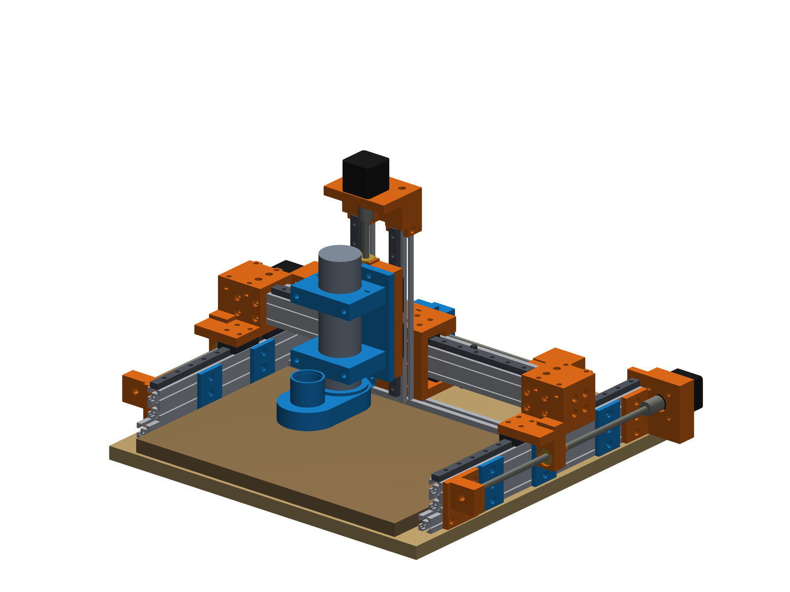
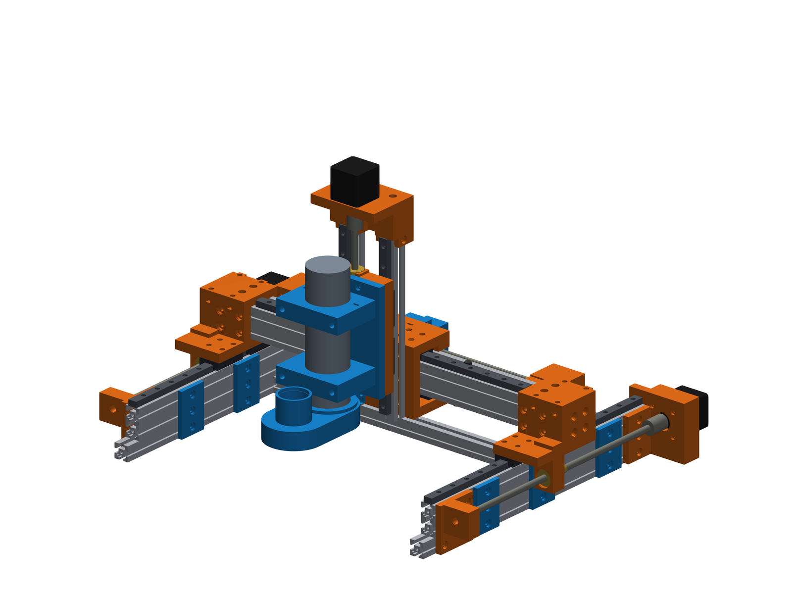

> **Work in progress / early release.** This build pack is actively developed. Parts, fits, docs, and Bambu projects may change; something may not match your leftover hardware yet. Build at your own risk and expect updates.

# MK CNC — scavenger gantry mill (build pack)

**Work envelope (nominal):** X **299** × Y **271** × Z **100** mm  
**Stack:** printed PLA / PETG / ASA parts + 2020 aluminium extrusion + MGN12 + T8 leadscrews + NEMA steppers (mostly recycled from 3D printers)

## Important — what this project is (and is not)

This machine was assembled **from leftover parts after various projects**, mainly **retired 3D printers** (rails, steppers, couplers, bearings, extrusion offcuts) plus a small shopping list.

It is **not** claimed to be the stiffest, fastest, or most elegant DIY CNC you can buy or design.  
It **is** a complete, documented way to **build a useful small mill from what you already have on the shelf**, with printable interfaces that make mismatched leftovers fit together.

If you want a purpose-optimised commercial kit or a heavy steel frame, look elsewhere.  
If you want to **turn printer scrap into a mill that can cut wood / soft plastics / light aluminium** (within reason), you are in the right place.

## What you get in this repository

| Path | Contents |
|------|----------|
| `stl/` | Printable parts in **print orientation** (English filenames; do not rotate in the slicer) |
| `docs/BOM.md` | Shopping list — what to buy, quantities, approximate EUR costs |
| `docs/PRINTING.md` | Slicer settings, orientations, quantities |
| `docs/ASSEMBLY.md` | Build order, fastener tips, common traps |
| `docs/OVERVIEW.md` | Machine layout + **all** renders |
| `docs/img/` | Assembly and per-part renders |
| `bambu/` | Bambu Studio multi-plate projects: `MK_CNC_P1S.3mf`, `MK_CNC_A1_mini.3mf` |

**Not included:** CadQuery parametric source, Fusion macros, firmware binaries — those stay local / unpublished. This repository is the single public build pack for **builders**.

## Quick specs

- Moving gantry (bridge) on Y; carriage on X; Z on twin 2020 columns
- Rails: MGN12 / MGN12H
- Screws: T8 (X/Y typically 8 mm lead; Z preferably 2 mm lead for self-locking)
- Default tool: ø52 mm 500 W DC spindle (ER11); optional Makita / laser / pen holders in `stl/`
- Operator front = spindle side; model **+X = operator's left** (invert GRBL X if you want joystick intuition)

## Build flow

1. Read [docs/OVERVIEW.md](docs/OVERVIEW.md) once (layout + all renders).
2. Check [docs/BOM.md](docs/BOM.md) — buy list with quantities and rough costs.
3. Print parts per [docs/PRINTING.md](docs/PRINTING.md).
4. Assemble per [docs/ASSEMBLY.md](docs/ASSEMBLY.md).
5. Wire steppers / limit switches / spindle to your controller (GRBL, FluidNC, …). Controllers are out of scope here.
6. Complete the [commissioning and safety checks](docs/COMMISSIONING.md) before the first powered move.

## Safety

- Eye and ear protection when milling.
- Secure workholding; the plywood/MDF table is sacrificial.
- Spindle and mains PSU are hazardous — if you are not comfortable with mains wiring, get help.
- Printed structural parts in PLA, PETG, or ASA are strong enough (reference machine: Bambu Basic PLA) for this size of machine when printed as specified; they are **not** a substitute for cast iron. Start with wood and plastics; aluminium needs conservative, validated cutting parameters.

## Licence

Hardware documentation and STL files: **CERN-OHL-P-2.0** (see `LICENSE`).  
Renders are part of the documentation set under the same terms.

## Credits

Designed and documented by **misiek1205**.  
Built as a scavenger project — reuse first, buy only what you must.
